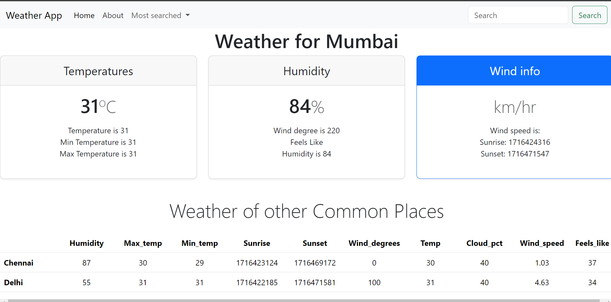

# Weather App

Welcome to the Weather App! This application provides weather information based on user input location using the RapidAPI service. 



## Table of Contents

- [Features](#features)
- [Installation](#installation)
- [Technologies Used](#technologies-used)
- [API Information](#api-information)
- [Contributing](#contributing)
- [Acknowledgements](#acknowledgements)
- [Created by](#created-by)

## Features

- Search for weather information by city.
- Display current temperature, humidity, wind speed, and weather conditions.
- Responsive design using Bootstrap.

## Installation

1. Clone the repository:
    ```bash
    git clone https://github.com/your-username/weather-app.git
    ```

2. Navigate to the project directory:
    ```bash
    cd weather-app
    ```

3. Open `index.html` in your preferred browser.

## Technologies Used

- **HTML**: For structuring the web page.
- **CSS**: For styling the application.
- **JavaScript**: For application logic and making API calls.
- **Bootstrap**: For responsive design and layout.
- **RapidAPI**: For fetching weather data.

## API Information

This application uses the [RapidAPI Weather API](https://rapidapi.com/hub) to fetch weather data. To run this application, you need to get an API key from RapidAPI and include it in your JavaScript file.

## Contributing

Contributions are welcome! Please fork the repository and submit a pull request with your changes. Ensure that you follow the coding standards and include appropriate tests.

## Acknowledgements

- [RapidAPI](https://rapidapi.com/) for providing the weather data API.
- [Bootstrap](https://getbootstrap.com/) for the responsive design framework.
- All the open-source libraries and tools used in this project.

## Created by

[Anisha Shankar](https://github.com/hahaanisha)
